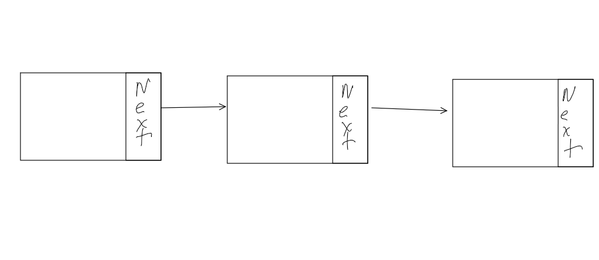

# Video Format

[Linked_list](linked_list.mp4)

# Introduction
Linked Lists are powerful. As talked about previously in [queues](queue.md) Linked lists have a lot of power in building queue's. However where else might it be helpful? Imagine building a system that is going to need to store information that is coming and going at random speeds. The amount of information you need to store is constantly changing, growing and shrinking. Storing all of that information in one place is going to be hard to do, esspecially if you never know how big or small it is going to be. This is where linked lists come into play. Linked Lists not only take O(1) time to add or remove information, it also stores information whereever it can be stored. This means that any cracks or holes in your memory will be filled with a linked list, rather then needing to take up a lot of space in one place. 

This could even imply that if you are running low on space and need just a little bit more saved, a linked list would be the perfect way to go while an array would require more compact space.

## Structure of Linked List
Linked lists have a little more complexity when it comes to how they are built. In an array since everything is right next to each other, the linked list is not. As we talked about before a linked list will fill any space it can get, but how does it know where the next spot is? It uses what is called a pointer. A pointer is going to tell it where the next item in the list is. This adds to the complexity of how it works because instead of having data right next to each other, we have pointes telling it where to go. This leads to  a system like what is below.

You can see in the picture that we have 3 boxes and in each box you have space to add data and then a place to add the next box to visit. This is the basic structure of a linked list.

It does get more compex as we may want to go backwards on the linked list rather then forward. This leads to the structer in the end looking like this 

What this allows is for us to go forward or backwards through the linked list to find the information that we need to.

## Adding to a Linked List
seeing how the structure of the linked list is very different then what we are used to, how would I add information into the linked list? It is a little more challenging then just shifting things over in memory and then sticking the new thing in it like we do for an array. What we have to do is change the pointers that are connected to what we are doing. This is very simple when dealing with the head or tail as we take the new information, we assign it to point at the previous head, then have the head move to it and then we have the previous head's previous point to the new information. Sound simple? probably not, here is a picture to help you visualize it. 

It gets a little more complacated when you are inserting into the middle of the list. When you do that it will be similar to when inserting into the head of the tail. What you do is add the pointers for the new information, you do that by assigning the next pointer to the node that will be after it, and the previous pointer to pointing at the node that will be previous. Following that you will assign the node that will be after it, to point to it, and the node that will be before it to point to the data.

This sounds really complicated, but once you get the feel for it, it is easy to accomplish.

## Efficency

How efficent is a linked list? Well it depends on what you want to do. A linked list is going to be O(1) to add data to any point of the linked list. However to find information will be O(n). This makes it really easy to add information but not as easy to find it. 

## Example and Problem

In this lesson I decided to combine the example and the problem together. I buit a rough linked list and left 3 functions for you to build. Those are the insert_before, is_in and remove function. 

The purpose of hte insert_before function will be to insert information into the linked_list by traversing from the tail to the head, and inserting a new_node before the it.

The purpose of the is_in function is to find out if something is found in the linked_list

Finally the remove function will remove an item from the linked list.

Here is the code: [Linked_list](linked_list_problem.py)

## Soulution

Once you have attempted the linked List problem, you can view the solution and solution video below.

[Linked_list_solved](linked_list_solution.py)

[Linked_List_video](linked_list_solution.mp4)