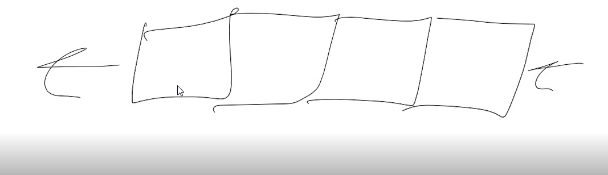

# Queue

## Video 
[queues](queue.mp4)

## Introduction

How frustrating is it when you call customer service and you are put on hold for a long period of time? If you are anything like me, you are extremly frustrated, esspecially if you are waiting for 30+ minutes. 

Why do I ask this question? Well when you call into the customer service line, how do they know what order you called? If you are familer with the concept of a stack then the first person to call would be the last person that they would work with. That would be completly unacceptable for the customer. So, in order to keep track programmers have created a Data Structure called a Queue. the Queue is what they use for call centers and 911 and many other services where information is stored and needs to be accessed from the first entered till the last entered.

## Structure of a Queue



Look at the picture above. What do you notice? The array in enqueuing at the end of the array, and the dequeueing at the start of the array. This is the simple way of showing a queue. When programming you will do simply what is shown. It will be that. You are going to build the queue to enqueue, or add information at the end, and dequeue from the start.

## example

You can find a simple example of a queue here: [queue](queue_example.py)

## performance

While looking through the queue in the example there are a couple of things to note on how efficent queue's are. I want you to ponder on how efficent this code is before you continue on. What do you think the Big-O notation is?

To jump start this conversation, the interesting thing when it comes to queue's is depending on what you are doing, will impact the efficency of the queue.

for example

```python
    def enqueue(self, data):
        self.queue.append(data)
```

In this code, this is going to be a O(1) efficency. For those unfamiler with Big-O notation, this means that it will take 1 time unit (every processor has different time units, but it is incredibly small) for every piece of information added to the queue. That is the ideal amount of time for any code. However when looking at the dequeue function

```python
    def dequeue(self):
        if len(self.queue) == 0:
            return 'there is nothing in the queue'
        return self.queue.pop(0)
```

This is going to be O(n) time. This means that it will take the number of time units equal to the number of items stored in the queue. This may not seem like much but lets look at internet servers. How many requests are they receiving every second? thousands. If not more. This is not a huge deal but what if there was a way to get the O(n) time down to O(1)?

## Practice problem

This is where you are going to come in. There is a Data Structure called a Linked List. You are going to learn more about it in the next unit, but for now you are going to use some things built in python to create a queue using a linked list. Doing so will enable you to have a queue that is running at O(1) time. 

How are you going to do that? You are going to use a function called deque (pronoced deck). You are going to finish the code found at [queue](queue_practice.py) using that function.

[solution](queue_solution.py)
